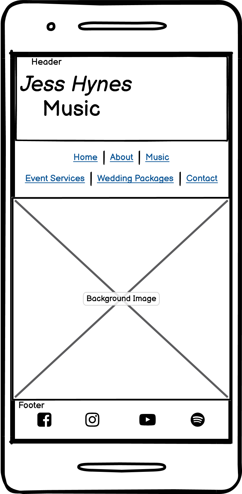

# Portfolio Project 1 - HTML / CSS
## **Jess Hynes Music - Live Site**
(live website link will go here)

## **Business Objectives**

For this project I have designed and created a genuine, static website for a professional, local singer. The website will be used to promote what she has to offer, as well as inform her potential clients/customers of the range of packages and entertainment that she provides.

The application is designed to be accessible to all users and responsive to all screen sizes, so that the targeted audience can easily navigate through the site and achieve what they set out to do.

The project's main purpose and focus is to ensure that I successfully complete my first milestone in the CI course.

## Client's Requests

In order to create an informative platform, these are the key features that the client has requested:
- an 'About Me' section - this gives a detailed insight into who Jess Hynes is and what skills she possesses.
- media (images and videos) - these are displayed throughout the website, as gallery style images as well as background images to add the desired aesthetic. *Images/videos are credited and sourced throughout.*
- a list of upcoming public gigs - this informs interested parties of where Jess' gigs are and when.
- sections/pages designated to different acts - Jess is part of 4 seperate acts, which have their own informative section or page within the website.
- a list of packages - this informs potential clients/customers of Jess' packages that she has to offer.
- a contact form - to allow potential clients/customers to get in touch with any enquiries that they may have. *As this project is HTML/CSS focused, the form is static until I have aquired further skills in order to be able to script in the necessary attributes and coding to send form input to a specific destination.*
- social media links - this allows users to access Jess' social platforms if desired.

(place markup image here)

## **User Experience (UX)**
### User Stories
- **First Time Visitor Goals**
  - As a first time visitor, I want to be able to quickly navigate through the site and see what style of music Jess has as I'm interested in going to see her at one of her public shows. I also want to easily locate her social media links.
  - As a first time visitor, I want to find reviews on the artist to see if she is good enough to hire for my event.

- **Returning Visitor Goals**
  - As a returning visitor, I want to locate a timetable of Jess' upcoming shows.
  - As a returning visitor, I want to find contact information to enquire about prices and availability.

- **Frequent Visitor Goals**
  - As a frequent visitor, I want to check for any newly added upcoming public shows that I can attend.
  - As a frequent visitor, I want to see if there are any new packages available for cooperate events.

### Design
- **Colour Scheme**
  
  - The main colour scheme is neutral and light, in order to highlight any dark text. As photographic images are generously used throughout the site, neutral colours will not take away any attention from the images that are put in place for promotional purposes.
  
- **Typography**

  - Fonts are imported into the CSS file via Google Fonts.
  - To keep the website looking clean and neutral, a selection of 3 fonts is used throughout the website, 2 of which have a very similar look and feel.
  - For the main heading which is the artists name, I have chosen to use the font family of 'Parisienne', with a fallback font of 'Cursive', in the event of the preferred font failing to import. This font will hopefully create a positive user experience when first entering the site as it exudes a professional yet warm mood.
  - For sub-headings which includes the navigation menu, along with sub-titles across the page/s, I have chosen to use the font family of 'Raleway' as it stands clean and clear, making a statement but not enough to draw attention away from more important features on the page. In the event of this font failing, I have set the fallback font to 'Sans-serif'.
  - For general text I have chosen the font family of 'Inter'. Again this is a clean and clear font that is easy to read, and maintains the neutral tone flowing throughout the site. Fallback font set to 'Sans-serif'.

- **Imagery**

  - Photographic imagery is used throughout the site. Gallery style images as well as background images across the page to give the user a well rounded look and feel of the clients' aesthetic and style. Images are used to capture the essense of the artist and the height of the entertainment that she brings.
  Each image is provided by the client and is taken from her social media accounts. These images are credited and sourced appropriately in the credit section of the README file and in comments above the relevant code.

### Wireframes
This web application has been designed and created with 'mobile-first' approach.

- Home page
