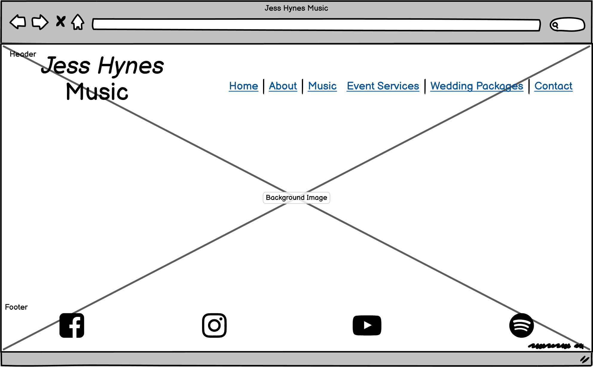
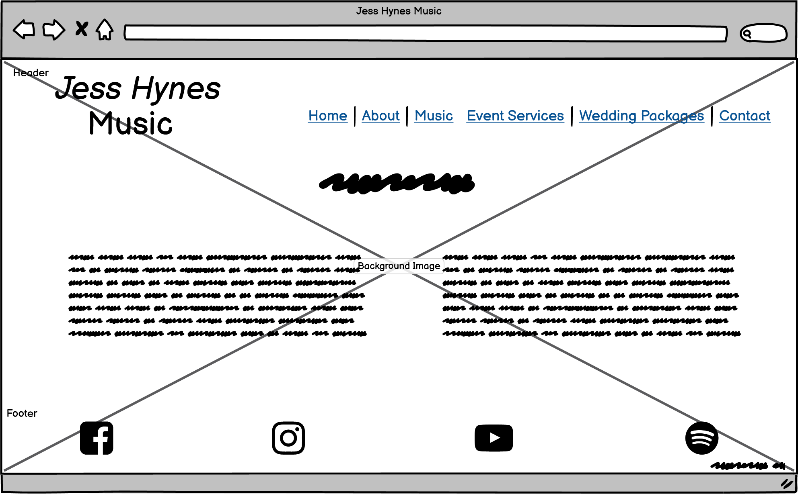
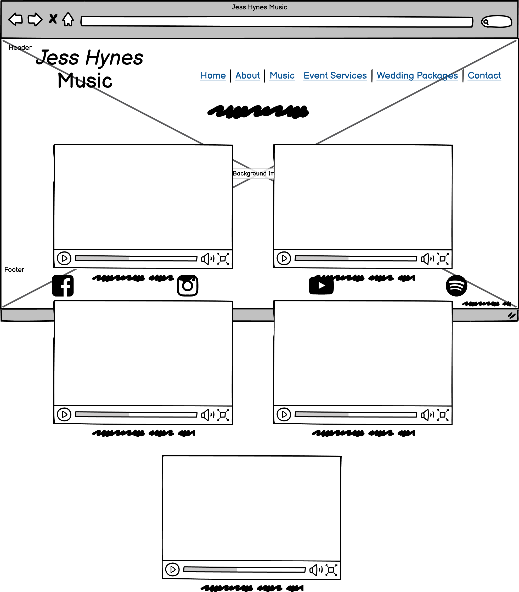
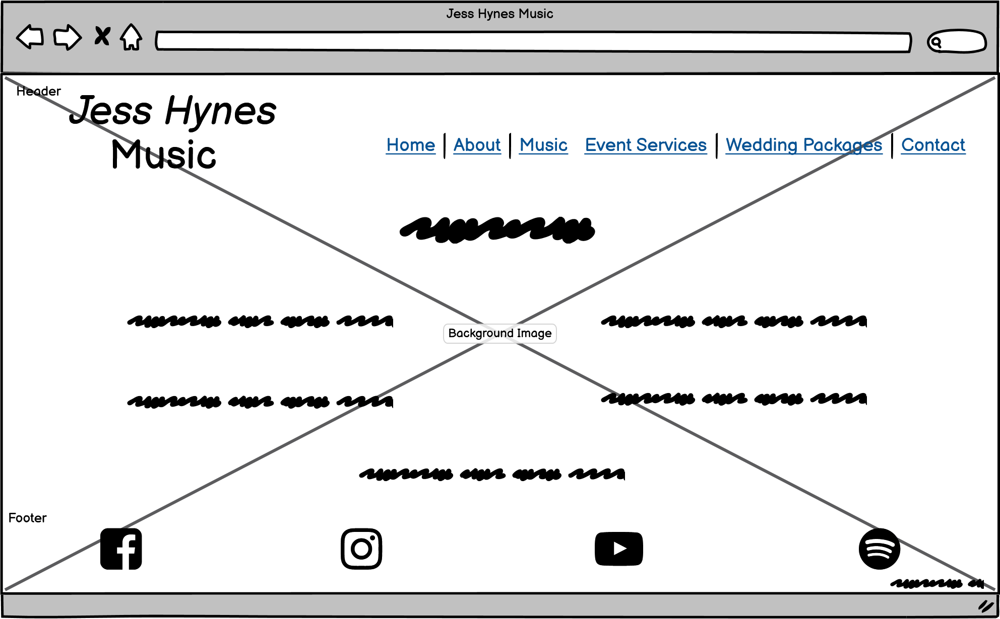
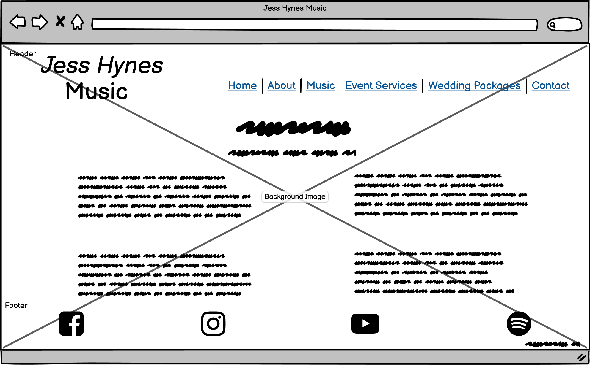

# Desktop
*On all desktop pages I have set the header and footer elements to have a transparent effect so that the background image comes through. Depending on how the background image looks, I may choose to eradicate this idea and stick with the header/footer being opaque. If it does work then I may change the mobile and tablet designs to have the same transparent effect.*
## Home

## About

## Music

## Event Services

## Wedding Packages

## Contact

[Back to README](README.md)