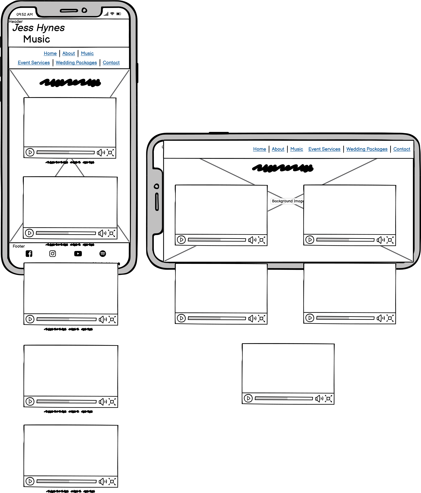
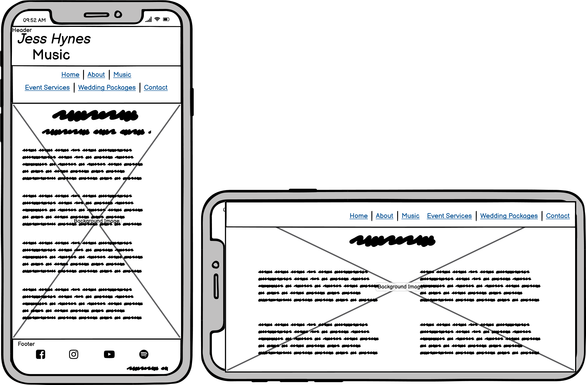

# Mobile

## Home

*The header, navigation menu and footer take up more screen space on the home page as there is less content. Users can easily find the page that they are looking for and social links are more apparent.*

## About

*The main heading and social links will not be displayed when in landscape on all pages except the home page. This is to create more space for informative content.*

## Music

## Event Services

## Wedding Packages

## Contact
